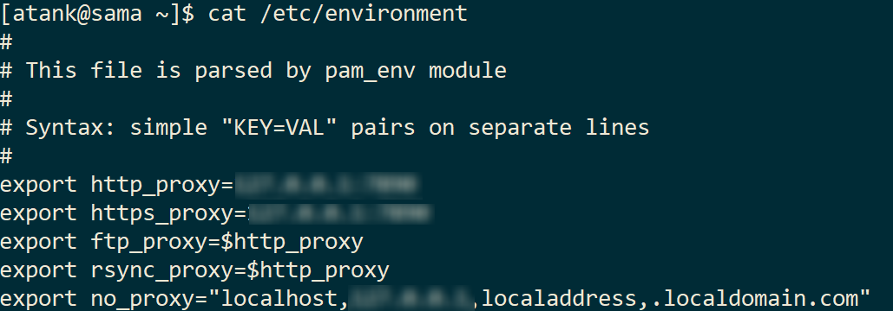
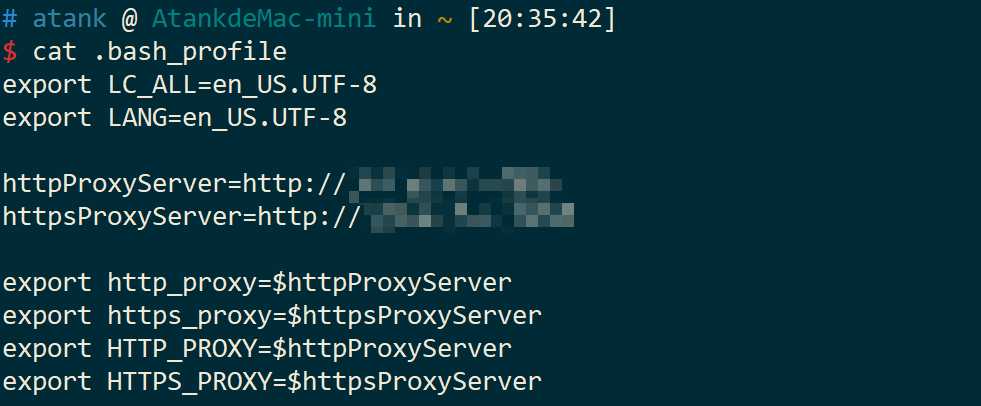

**<font size="2">阿坦 © 2023</font>**

---

**我们常常会需要设置全局变量，用来提供给程序或是自己使用。**

有时候，我们会进一步希望所设置的全局变量能够一直有效。不然每一次重新开启 CLI 或是重新启动机器，都要重新再设置全局变量，这就很麻烦。

那么本文就来分享一下如何设置全局变量。

### For Windows

我们通常在 Windows 使用 PowerShell 作为 CLI. 那么在 **PowerShell** 如何设置呢？

```powershell
[Environment]::SetEnvironmentvariable('key', 'value')
```

通过上面的设置方式设置的全局变量会一直有效。

可以关闭 PowerShell 重新打开，然后使用如下命令检查一下：

```powershell
[Environment]::GetEnvironmentVariable('key')
```

**举例：**


### For Linux

对于 Linux OS, 我们通常首先需要确认我们使用的是哪种 shell.

使用命令 `ps -p $$` 就可以看到：


如果是 [bash (Bourne shell)](https://en.wikipedia.org/wiki/Bourne_shell), 就使用 `export key='value'` 这样的句式设置全局变量。（同样的语法对于大多数 bash 应该也适用）

比如：

```bash
export http_proxy='http://myproxy.com'
```

如果想要每次重新打开 bash 都有这个全局变量，那么就把它写入 `$HOME/.bashrc` 文件（或者 `/etc/environment` 文件) 里面。如下图：



###  For Mac

Mac OS 的终端通常使用 zsh 作为默认的 shell,  zsh 设置全局变量的语法和 bash 一样，遵循语法 `export key=value`  就好。

如果要让设置一直有效，那么把全局变量定义在 `$HOME/.zshrc` 文件里面。如下图：



### 完

OK, 命令行全局变量的设置，你学会了吗？