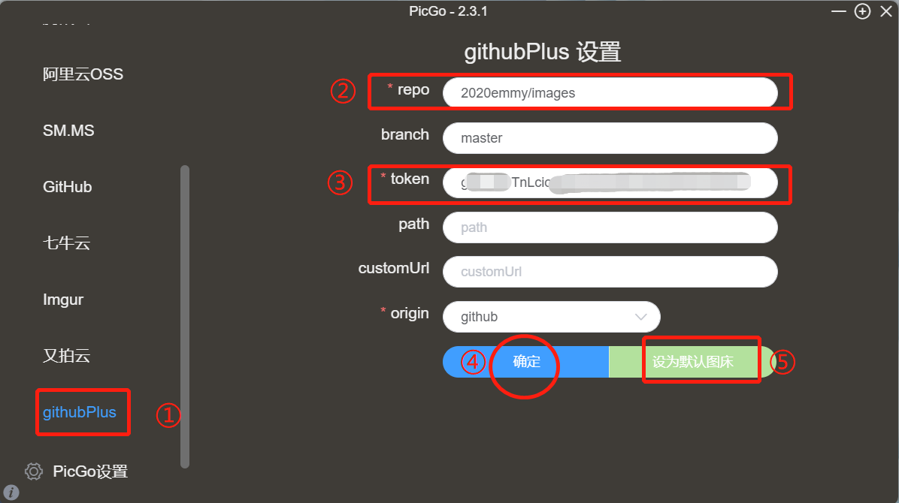

其实，这是一篇综合教程，里面的东西即使不用做提交作业，也值得一学。

## 1.创建Github仓库

1. 登录Github，打开连接：[https://github.com/new](https://github.com/new)
2. 在 `Repository name`内输入 `images`，然后点击页面底部的 `Create repository`创建一个名为 `images`的仓库

   

## 2.创建Github Token

1. 登录Github，打开连接：https://github.com/settings/tokens
2. 点击 `Generate new token(classic)`

   
3. 按照下图，依次填写，选择，然后点击页面底部的 `Generate token`

   
4. 如下图，打了马赛克的部分就是生成的Token，点击复制按钮，复制生成的Token并保存下来，后面会用，注意，请妥善保管Token，拥有Token相当于可以操作你的Github仓库，当然，如果泄露，点击 `Delete`删除重新创建即可

   

## 3.设置PicGo

1. 下载并安装PicGo，下载连接：

   * [Windows](https://github.com/Molunerfinn/PicGo/releases/download/v2.3.1/PicGo-Setup-2.3.1-ia32.exe)
   * [Mac Intel](https://github.com/Molunerfinn/PicGo/releases/download/v2.3.1/PicGo-2.3.1-x64.dmg)
   * [Mac M1](https://github.com/Molunerfinn/PicGo/releases/download/v2.3.1/PicGo-2.3.1-arm64.dmg)
2. 点击插件设置，搜索 `github`关键字并安装 `github-plus 1.2.3`插件

   
3. 点击图床设置，拖到底部，找到 `githubPlus`，然后按照截图填写信息，其中 `vwumumu`，替换为你自己的github账号，比如 `zhangsan`，即填写为 `zhangsan/images`，在token项目中填入上一部创建的 `token`，然后点击 `确定`和 `设为默认图床`按钮。

   

   > 爱梅：此处设置容易出错，在PicGo-图床设置-要找到githubPlus设置，如下图。我在设置的时候没有往下拉到底在githubPlus处设置，而是进入了Github设置，导致配置出错。这里是需要注意的一个点。
   >

   
4. 
5. 
6. 
7. 

## 4.配置Typora

1. 获取PicGo路径：鼠标右键点击桌面上的PicGo图标，选择属性，复制 `目标`里面的内容

   
2. 文件——偏好设置——图像，按照下图进行设置，其中，`PicGo路径`一项，将第1步复制的信息粘贴进去，然后点击 `验证图片上传选项`

   
3. 出现如下结果表示配置成功，有时点击 `验证图片上传选项`会失败，原因是已经验证过，再次点击验证时实际上上传了同名文件，所以会报错，可以直接用typora插入图片测试，看图片地址是否是github上的地址，而不是本地地址

   

## 5.用Typora回答编程学习的作业

比如，回答《作业：1-5-函数》

1. 点击左下角的源代码图标，或者按 `ctrl + /`


2. 复制所有源码，比如我回答的作业源码如下：

   ```markdown
   # 作业：1-5-函数

   **作业：进一步理解处理过程和输出**

   ```python
   def demo():
       print("Hi")
       return "Hi"

   demo()

   a = demo()

   print(a)
   ```

   上面的代码会打印出3个Hi，请解释。


   这道作业的关键在于理解函数中print("Hi")中的Hi与return中的Hi发挥着什么作用？

   3个Hi，哪个是print打印出来的？哪个是return出来的？


   我们稍微修改一下代码，再运行一下：

   

   可以看到，前两个Hi来自print()函数，第3个Hi来自return。

   解释一下：

   首先，print("Hi")是demo()函数运行中的处理过程，这个过程只是打印一个Hi；

   return才是demo()这个函数本身的输出，是字符串Hi

   a = demo()，是将demo()函数本身的输出赋值给a

   所以a所代表的值是return中的Hi

   而一开始执行demo()和执行a = demo()这个赋值过程时，demo()这个函数会被调用

   所以，调用时，函数内部的print就会被执行，于是打印出了Hi2。

   这就是这3个Hi的出处。
   ```

## 6.提交作业

将源码粘贴到”编程学习助手“机器人消息窗口，按 `shift + alt + 回车`发送消息，会给机器人发送一个Markdown格式的消息：

   

至此，作业就完成了提交，机器人会将作业转交给“技术组”进行评阅。


