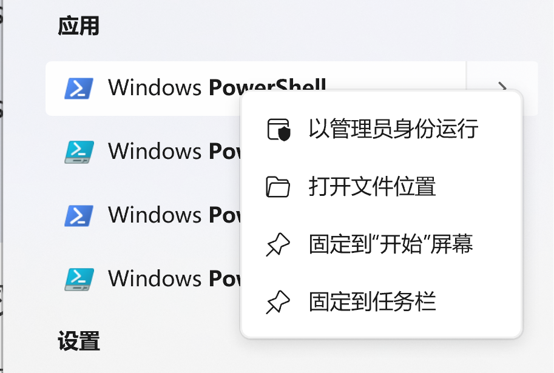

:::info 信息

[视频](https://www.bilibili.com/video/BV1Jo4y1Y7SC/?vd_source=4a888db8814702b2062fcaf2575be745)
:::

## 打开命令行

### Windows

按键盘上的“Win”键，或点击Windows任务栏的“开始”按钮，然后输入powershell，即可找到Windows PowerShell。


普通权限和管理员权限：

直接点击是使用普通权限打开Windows  PowerShell;

右键点击，选择以管理员身份运行，是以管理员权限打开，很多时候在命令行遇到“Access”，“Permission”等报错信息，是因为命令行权限不够，此时，需要以管理员权限打开命令行，重新执行需要执行的命令。



### Mac


## 大小写敏感
大小写敏感是指大小写是否等价，比如A和a是不是一个东西？
windows大小写**不敏感**
MAC大小写**敏感**


## 路径分隔符

电脑中的文件夹是有层级关系的，在命令行中，表现为路径。
相邻的层级用一个分隔符分隔。
在Windows系统中，路径分隔符是反斜杠（\），而在MAC系统中，路径分隔符是正斜杠（/）。


## 切换路径

```powershell
cd path
```


## 创建目录

```powershell
mkdir
```


## 查看路径下的文件

```powershell
ls
```

## 查看当前路径
``` powershell
pwd
```


## 打开当前目录

Windows:

```powershell
start .
```

Mac:


```shell
open .
```


## 相对路径和绝对路径

> 绝对路径：指的是以根目录（根据操作系统不同，根目录也不同）为起点，引用某一文件或目录的完整路径。
> 
> 相对路径：指的是相对于当前目录的路径，不需要以根目录为起点，而是以当前所在的目录为起点。

绝对路径，到底在电脑上的哪个位置？相对路径，相对于当前路径，对一个路径的表示。

`.`表示当前路径；
`..`表示上一级路径。
