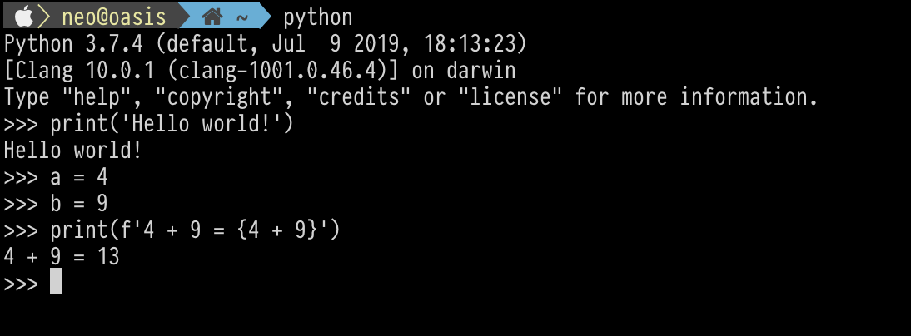

# 理解编程语言

简单地说，程序就是人类书写交由机器去执行的一系列指令，而编程语言是书写时遵照的语法规则。

编程很像教孩子，计算机就像一个孩子，一开始什么都不懂，也不会自己思考，但非常听话，你教TA怎样就怎样，一旦学会的就不会忘，可以不走样地做很多次不出错。但是如果教的不对，TA也会不折不扣照做。

对我们来说，和孩子的教育一样，关键在于理解对方的沟通语言，以及理解对方会如何理解你的表达。

## 计算机系统和 CPU

计算机本身并不复杂，大致上就是三部分：
* 负责执行指令的**中央处理器（CPU）**；
* 负责存放 CPU 执行所需要数据的**内存**；
* 各种**外设**，像硬盘、键盘、鼠标、显示设备、网卡等等这些都是。

这里面 CPU 是核心的核心，因为它相当于人的大脑，我们教给计算机的指令实际上就是 CPU 在一条一条地执行，执行过程中会读写内存里的数据，会调用各种外设的接口（通过一种叫做“设备驱动”的软件模块）来完成数据的输入输出（I/O）操作。

CPU 是一种计算机芯片，芯片可以执行的指令是在设计时就定好的， 不同芯片有不同的指令集，固化在硬件里，一般无法改变。因为大小、发热和功耗等问题，芯片的指令集不能面面俱到，而是有所侧重，比如一般计算机里 CPU 芯片比较擅长整数的运算，而 GPU（图形处理芯片，也就是显卡）比较擅长浮点数的运算，计算机图形处理尤其是 3D 图形处理会涉及大量的浮点运算，所以通常交给 GPU 去做，又快又省电；后来人们发现除了 3D 图形处理，人工智能等领域的一些科学计算也多是浮点运算，所以 GPU 也被拿来做这些计算工作。而我们的手机里的芯片，是把 CPU/GPU 还有其他一些做特殊工作的芯片集成在一块硅晶片上，这样可以节省空间，也能节约功耗，这种高度集成的芯片就叫 SoC（*System on Chip*）。

## 汇编和编译器

那么 CPU 执行的代码长啥样呢，我们可以瞄一眼，大致长这样：

```nasm
_add:                                   ## @add
push rbp
mov rbp, rsp
mov dword ptr [rbp - 4], edi
mov dword ptr [rbp - 8], esi
mov esi, dword ptr [rbp - 4]
add esi, dword ptr [rbp - 8]
mov eax, esi
pop rbp
ret

_main:                                  ## @main
push rbp
mov rbp, rsp
sub rsp, 16
mov dword ptr [rbp - 4], 0
mov edi, 27
mov esi, 15
call _add
add rsp, 16
pop rbp
ret
```

这叫汇编指令（*assembly*），和 CPU 实际执行的“机器指令（*machine code*）”几乎一样了，只是机器语言是二进制的，全是 01011001 这样，而汇编将其翻译成了我们稍微看得懂的一些指令和名字。机器可以直接执行的指令其实不多，在 Intel 官方的 [x64 汇编文档](https://software.intel.com/en-us/articles/introduction-to-x64-assembly) 里列出的常用指令码只有 20 多个，上图中的 `mov` `push` `pop` `add` `sub` `call` `ret` 等都是。我们目前并不需要搞懂这些都是干啥的，不过可以简单说一下，`mov` 就是把一个地方保存的数写到另一个地方，`call` 是调用另外一个代码段，`ret` 是返回 `call` 的地方继续执行。

所以其实计算机执行的指令大致就是：
* 把数放到某地方，可能在 CPU 内部也可能在内存里；
* 对某地方的数进行特定运算（通常是加减乘除）；
* 跳转到另一个地方执行一段指令；
* 返回原来的位置继续执行。
如此这般。

可以想象，如果要完成复杂的任务，涉及复杂的逻辑流程，用汇编代码写起来可要费好大的劲儿了。但这就是机器的语言，CPU 实际上就只会这种语言，别的它都听不懂，怎么办？

想来想去，是不是有可能我们用某种方式写下我们解决问题的方法，然后让计算机把这些方法翻译成上面那种计算机懂的指令呢？这种翻译的程序肯定不好写，但是一旦写好了以后所有人都可以用更接近人话的方式表达，计算机也能自己翻译给自己并且照做了，所谓辛苦一时享受一世，岂不美哉。程序员的典型思维就是这样：如果有个对人来说很麻烦的事情，就要试试看是不是可以让计算机来做。

这个想法早已被证明完全可行，这样的翻译程序叫做“编译器（*compiler*）”。现在存在于世的编程语言有数百种，每一种都对应一个编译器，它可以读懂你用这语言写的程序，经过词法分析（*tokenizing*）、语法分析（*parsing*）、语义分析（*semantic analysis*）、优化（*optimization*）和代码生成（*code emission*）等环节，最终输出像上面那样机器可以看懂和执行的指令。

编译理论和实现架构已经发展了很多年，已经非常成熟，并在不断优化中。只要愿意学习，任何人都可以设计自己的编程语言并为之实现一个编译器。

顺便，上面的汇编代码是如下的 C 语言代码通过 LLVM/Clang 编译器的处理生成的：

```c
int add(int a, int b) {
   return a + b;
}

int main() {
   return add(27, 15);
}
```

C 语言被公认是最接近机器语言的“高级编程语言”，因为 C 语言对内存数据的管理方式几乎和机器语言是一样的“手工操作”，需要编程者非常了解 CPU 对内存的管理模式。但尽管如此，C 语言还是高级编程语言，很接近我们人类的语言，基本上一看就懂。

各种各样的高级编程语言，总有一样适合你，这些语言极大地降低了计算机编程的门槛，让几乎所有人都有机会编程，而这一切都是因为有编译器这样的“自动翻译”存在，建立了人类和机器之间畅通的桥梁。

## 解释器和解释运行

前面我们介绍了编程语言编译为机器代码的原理，我们写好的程序可以被编译器翻译为机器代码，然后被机器运行。编译就好像把我们写好的文章整篇读完然后翻译为另一种语言，拿给会那个语言的人看。

还有另外一种运行程序的方法，不需要整篇文章写完，可以一句一句的翻译，写一句翻一句执行一句，做这件事的也是一个程序，叫解释器（*interpreter*）。解释器和编译器的主要区别就在于，它读入源代码是一行一行处理的，读一行执行一行。

解释器的好处是，可以实现一种交互式的编程，启动解释器之后，你说一句解释器就回你一句，有来有回，很亲切，出了问题也可以马上知道。现代人几乎不写信了，打电话和微信是主要的沟通模式，可能也是类似的道理吧。

Python 就是一种解释型语言，在命令行界面运行 `python` 主程序，就会进入一个交互式的界面，输入一行程序立刻可以得到反馈，差不多就是这个样子：



这就是 Python 的解释器界面，这种输入一行执行一行的界面有个通用的名字叫做 *REPL*（*read–eval–print loop* 的缩写），意思是这个程序可以读取（*read*）你的输入、计算（*evaluate*）、然后打印（*print*）结果，循环往复，直到你退出——在上图的界面中，输入 `exit()` 回车，就可以退出 Python 的 *REPL*。

我们还可以把 Python 程序源代码（*source code*）存进一个文件里，然后让解释器直接运行这个文件。打开命令行界面（我们假定你已经[设置好了你的编程环境](./x1-setup.md)），执行下面的操作：

```shell
cd ~/Code
touch hello.py
code hello.py
```

在打开的 VSCode 中输入下面的代码：

```python
print(f'4 + 9 = {4 + 9}')
print('Hello world!')
```

保存，回到命令行界面执行：

```python
python hello.py
```

解释器会读取 `hello.py` 里面的代码，一行一行的执行并输出对应的结果。

> 在有的系统中，`python` 不存在或者指向较老的 Python，可以通过 `python -V` 命令来查看其版本，如果返回 2.x 的话，可以将上述命令改为 `python3 hello.py`。

解释器的实现方式有好几种：
* 分析源代码，直接执行（做某些解释器已经定义好的事情），或者
* 把源代码翻译成某种特定的中间代码，然后交给一个专门运行这种中间代码的程序执行，这种程序通常叫虚拟机（*virtual machine*），或者
* 把源代码编译为机器代码然后交给硬件执行。

无论哪种方式，其实也会有词法分析、句法分析、语义分析、代码优化和生成等过程，和编译器的基本架构是相似的，事实上由于实现上的复杂性，有时候编译和解释之间并没有那么硬的界限。

Python 官方解释器的工作原理是上列的第二种，即生成中间代码——叫做“字节码（*bytecode*）”——和虚拟机的方式；而另外有种 Python 的实现（[PyPy](http://pypy.org/)）采用的是第三种方式，即预编译为机器码的方式。

在这本书里，绝大部分代码运行用的是 Jupyter Lab，它的目标是把 *REPL* 做的更好用，让我们可以在浏览器中使用，有更好的语法高亮显示，最棒的是，可以把我们交互编程的过程保存下来，与人共享。不过它背后还是 Python 解释器，和命令行界面下运行 `python` 没有本质区别（但用起来的愉快程度和效率还是有很大区别的）。

> Jupyter Lab 通过一个可扩展的架构正在支持越来越多的文档类型和编程语言，以后学习很多别的语言也可以用它。

要使用 Jupyter Lab 需要先用 Python 的包管理工具 `pip` 来安装：

```shell
pip install jupyterlab
```

然后就可以用 `jupyter lab` 来运行 Jupyter Lab，在里面打开 *notebook* 进行交互式编程的尝试了，最好的办法是[使用我们的学习用书](./x2-students-book.md)。

## 小结

* 程序是人类书写交由机器去执行的一系列指令，而编程语言是书写时遵照的语法规则；
* 计算机 CPU 只能理解非常基础的指令，人要直接写出机器指令是困难和低效的；
* 编译器和解释器是一些特殊的程序，能够把我们用高级编程语言编写的程序翻译成机器指令，然后交给计算机去执行；
* 可以通过命令行 REPL、命令行加源文件和 Jupyter Lab 这样的可视化环境来运行 Python 程序，背后都是 Python 解释器。
